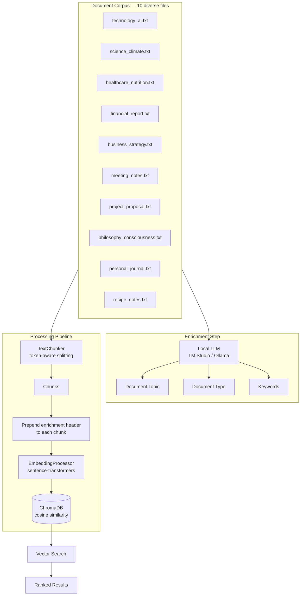

# PoC: Enhancing RAG Retrieval with LLM-Generated Enrichment

A **proof of concept** exploring whether prepending LLM-generated document metadata (topic, type, keywords) to text chunks before embedding improves vector search relevance in a RAG pipeline.

## Hypothesis

> **Injecting high-level document context directly into each chunk's embedding — via an LLM-generated enrichment header — produces more semantically relevant search results than embedding raw chunks alone.**

The intuition: a chunk that says *"the model achieves 94% accuracy"* is ambiguous on its own, but enriched with `[Topic: AI Image Classification]` it becomes unmistakably about computer vision. The embedding vector carries the document-level context, so queries match on meaning rather than just surface terms.

## Experiment Design



### Variables

| Variable | Value |
|---|---|
| **Embedding model** | `BAAI/bge-base-en-v1.5` (768-dim) |
| **Chunk size** | 512 tokens |
| **Chunk overlap** | 64 tokens |
| **LLM backends** | LM Studio / Ollama (configurable) |
| **Distance metric** | Cosine similarity |
| **Enrichment fields** | `document_topic`, `document_type`, `keywords` |
| **Corpus** | 10 documents across diverse domains |

### Enrichment Format

Every chunk that enters the embedding model is prefixed with:

```
[Document Topic: Artificial Intelligence Overview]
[Document Type: Technical Article]
[Keywords: AI, machine learning, deep learning, neural networks]

<original chunk text...>
```

The vector thus encodes both the **local content** (the chunk) and the **global context** (the document it belongs to).

## Key Hypothesis to Test

1. **Cross-topic retrieval** — Does a query about "machine learning" rank chunks from `technology_ai.txt` higher when they're enriched?
2. **Ambiguous-chunk disambiguation** — Does a chunk mentioning "profit margins" rank higher under `financial_report.txt` than a recipe file when enriched?
3. **Keyword overlap** — Do LLM-extracted keywords bridge the vocabulary gap between queries and chunk text?
4. **Ablation** — How does enriched retrieval compare to vanilla (no-enrichment) retrieval on the same corpus?

## Project Structure

```
├── settings.py              # Centralized config via Pydantic-Settings (.env)
├── embedding_processor.py   # Text → vector embeddings (sentence-transformers)
├── text_chunker.py          # Token-aware text splitting (langchain)
├── document_analyzer.py     # LLM-based document analysis (LM Studio / Ollama)
├── vector_store.py          # Pipeline orchestrator + ChromaDB operations
├── run_pipeline.py          # End-to-end example script
├── test_all.py              # Quick test for analyzer & embedder
├── helper/
│   └── check_db.py          # Inspect ChromaDB contents
└── sample_files/            # 10 diverse text files for PoC testing
```

## Quick Start

### 1. Install dependencies

```bash
pip install -r requirements.txt
```

### 2. Configure (optional)

Create a `.env` file to override settings:

```ini
embedding_model_name=BAAI/bge-base-en-v1.5
llm_provider=lmstudio   # or "ollama"
```

### 3. Start your LLM backend

| Backend | Default URL | Command |
|---|---|---|
| **LM Studio** | `http://localhost:1234` | Start server in app |
| **Ollama** | `http://localhost:11434` | `ollama serve` |

### 4. Run the pipeline

```bash
# Process a document (analyze → chunk → enrich → embed → store)
python vector_store.py process sample_files/technology_ai.txt

# Search the vector store
python vector_store.py search "What is artificial intelligence?"

# Reset the database between experiments
python vector_store.py reset
```

### 5. Run the example pipeline

```bash
python run_pipeline.py
```

## Modules

### `settings.py`

Centralized config via [Pydantic-Settings](https://docs.pydantic.dev/latest/concepts/pydantic_settings/). Override anything with a `.env` file.

| Setting | Default | Purpose |
|---|---|---|
| `embedding_model_name` | `BAAI/bge-base-en-v1.5` | Model used for embeddings |
| `llm_provider` | `lmstudio` | Backend for document analysis |
| `llm_model` | `default` | Model name passed to the LLM |
| `chunk_size` | `512` | Max tokens per chunk |
| `chunk_overlap` | `64` | Overlap between consecutive chunks |
| `chroma_db_path` | `./chroma_db` | Where ChromaDB persists data |
| `chroma_top_k` | `5` | Default number of search results |

### `embedding_processor.py`

Wraps [sentence-transformers](https://www.sbert.net/) for generating embeddings. Model is lazy-loaded and cached.

```python
ep = EmbeddingProcessor()
vec = ep.embed("text")               # single embedding
vecs = ep.embed_batch(["a", "b"])    # batched
```

### `text_chunker.py`

Token-aware splitting using the embedding model's own HuggingFace tokenizer + LangChain's `RecursiveCharacterTextSplitter`.

```python
chunks = chunk_file("sample_files/technology_ai.txt")
for c in chunks:
    print(f"[{c.index}] {c.token_count} tokens")
```

### `document_analyzer.py`

Sends the full document to a local LLM and returns structured JSON:

- `document_topic` — concise title
- `document_type` — category (Article, Report, Essay, etc.)
- `keywords` — 3–8 key terms

```python
da = DocumentAnalyzer(provider="lmstudio", model="google/gemma-4-e4b")
result = da.analyze("sample_files/technology_ai.txt")
```

Supports both LM Studio and Ollama backends, with markdown fence stripping and JSON fallback handling.

### `vector_store.py`

The main orchestrator — runs the full pipeline and manages ChromaDB:

| Function | Purpose |
|---|---|
| `process_and_store(file_path)` | Full pipeline: analyze → chunk → enrich → embed → store |
| `search(query_embedding, top_k)` | Cosine similarity search with metadata |
| `reset_database()` | Wipe all records for a fresh experiment run |

```python
ids = process_and_store(
    "sample_files/philosophy_consciousness.txt",
    analyzer=DocumentAnalyzer(model="google/gemma-4-e4b"),
)

ep = EmbeddingProcessor()
query_vec = ep.embed("What is the hard problem of consciousness?")
results = search(query_vec, top_k=3)
```

## Running the Experiment

### Baseline (no enrichment)

To test the null hypothesis, modify `_build_enriched_text()` in `vector_store.py` to return plain chunk text, then compare search rankings side by side.

### Metrics to Track

| Metric | What It Measures |
|---|---|
| **Relevance@K** | Are the top-K results from the expected document? |
| **Mean Reciprocal Rank (MRR)** | How early does the correct document appear? |
| **Distance separation** | Does enrichment push relevant results closer / irrelevant ones farther? |
| **Ablation score** | Delta in relevance when enrichment is removed |

## Sample Corpus

The `sample_files/` directory contains 10 documents chosen for maximum topical diversity — ideal for testing cross-domain retrieval:

| File | Topic |
|---|---|
| `technology_ai.txt` | Artificial Intelligence & Machine Learning |
| `science_climate.txt` | Climate Change & Global Warming |
| `healthcare_nutrition.txt` | Nutrition & Healthy Eating |
| `financial_report.txt` | Corporate Financial Report |
| `business_strategy.txt` | Business Strategy & Management |
| `meeting_notes.txt` | Project Kick-off Meeting Notes |
| `project_proposal.txt` | Software Development Proposal |
| `philosophy_consciousness.txt` | Philosophy of Mind |
| `personal_journal.txt` | Personal Reflective Journal |
| `recipe_notes.txt` | Cooking Recipes & Techniques |

## How Enrichment Works (Detailed)

1. **Analyze** — The full document text is sent to a local LLM which returns `document_topic`, `document_type`, and `keywords` as JSON.
2. **Chunk** — The document is split into token-aligned chunks using `RecursiveCharacterTextSplitter` with the embedding model's tokenizer.
3. **Enrich** — Each raw chunk has an enrichment header prepended:

```
[Document Topic: Climate Change Overview]
[Document Type: Scientific Article]
[Keywords: global warming, CO2 emissions, greenhouse gases, rising sea levels]

The global average temperature has increased by 1.2°C since...
```

4. **Embed** — The enriched text (header + chunk) is passed to the embedding model. The resulting vector encodes both chunk-level and document-level semantics.
5. **Store** — Vectors and metadata (including the raw enrichment fields for post-filtering) are persisted in ChromaDB.
6. **Search** — A query is embedded and compared via cosine similarity against all stored vectors. Richer vectors → better rankings.

## Why This Matters for RAG

Standard RAG pipelines embed raw chunks and hope the vector captures enough context. This PoC tests a cheap but potentially high-impact enhancement:

- **No fine-tuning required** — enrichment uses a general-purpose LLM, not a trained classifier.
- **No model changes** — enrichment is an input transform; any embedding model benefits.
- **Metadata doubles as filter** — `document_type` and `keywords` are stored separately in ChromaDB for hybrid search (pre-filter by type, then rank by similarity).

## Dependencies

| Package | Role |
|---|---|
| `sentence-transformers` | Text embedding generation |
| `requests` | HTTP calls to LLM backends |
| `pydantic-settings` | Configuration management with `.env` support |
| `langchain-text-splitters` | Token-aware `RecursiveCharacterTextSplitter` |
| `chromadb` | Persistent vector database with cosine similarity |